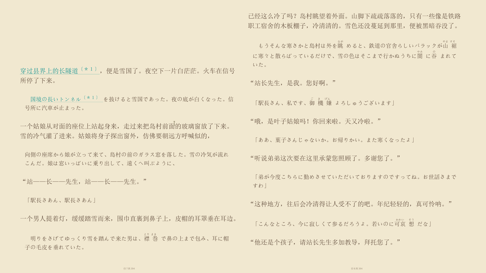
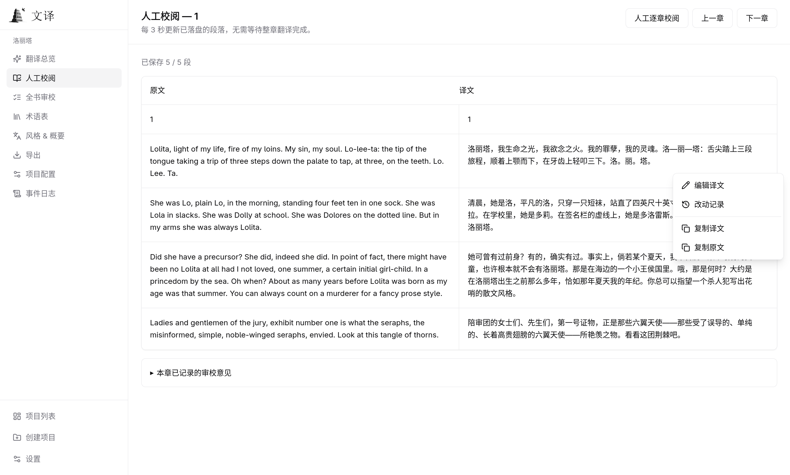

<h1>
  
   
  
</h1>

**Carry stories across languages.**

A desktop app for translating books and long-form writing, with the whole work in view.

Whole-book understanding · Consistent terminology · Evidence-based review

[Download Desktop](https://github.com/BigDawnGhost/wenyi/releases) · [Quick start](#quick-start) · [Language support](#language-support) · [Documentation](#documentation)

**English** | [简体中文](docs/zh/README.md)

---

## Table of contents

- [Why Wenyi](#why-wenyi)
- [Core features](#core-features)
- [Interface preview](#interface-preview)
- [Quick start](#quick-start)
- [Supported formats](#supported-formats)
- [Translation pipeline](#translation-pipeline)
- [Documentation](#documentation)
- [Limitations](#limitations)
- [Community](#community)
- [Support](#support)
- [Star history](#star-history)
- [License](#license)

---

## Why Wenyi

| Typical approach | Wenyi |
|---|---|
| Segments translated in isolation, unaware of surrounding content | Whole-book prescan with chapter digests and rolling context |
| Glossary managed manually or as an afterthought | Real-time term extraction with conflict detection, fed back into subsequent batches |
| Single-pass translation, fragile to interruptions | Batch checkpoints and chapter status tracking: reopen the project and resume saved progress |
| Raw model output, no systematic quality process | Translate → polish → evidence-driven whole-book review |

Wenyi is designed for **long-form texts** — novels, social-science monographs, narrative nonfiction, and more.

  
   
  A bilingual reading sample: translation alongside visually subdued source text.

---

## Core features

- **Local Desktop app** — import books, translate, proofread, and save exports in one application. Projects stay in an independent local workspace; packaged releases include the Python engine, with no separate Python, PostgreSQL, Redis, or Docker setup. See the [Desktop guide](docs/desktop.md).
- **Visual proofreading** — English and Chinese interfaces, live translation progress, paragraph editing with revision history, and whole-book review with evidence and publication results.
- **Native file and credential support** — drag files into a new project, choose export destinations with the system save dialog, and save API keys in the OS credential store when available.
- **Whole-book understanding** — prescans the source before translation, creating per-chapter digests and a book-level synopsis injected into every batch
- **Real-time glossary** — extracts proper names, terms, and recurring expressions as translation progresses; detects conflicting translations and surfaces them for resolution
- **Multi-stage quality** — optional polishing (strong model) and an evidence-driven whole-book AI review
- **Resumability** — completed batches and chapter progress are saved; reopen the application and continue from saved checkpoints
- **Multiple LLM providers** — DeepSeek, OpenAI, OpenRouter, OrcaRouter, Google Gemini, Ollama, vLLM, and generic OpenAI-compatible endpoints; keep three convenient tiers or select models per operation, mix connections, and share request limits. See [model routing](docs/configuration.md#models-and-operation-routing).
- **Native EPUB preservation** — writes translated text back into the original XHTML templates and attempts to preserve styles, images, TOC, and anchors
- **Bilingual output** — optional source-and-translation edition with visually subdued source text, including dark mode support

---

## Interface preview

Track translation progress, usage, and elapsed time, then proofread paragraphs alongside the source. Desktop and Web share these workspace pages; the screenshots below were taken in Web and show the Chinese interface. English is available in Settings. See the [Desktop guide](docs/desktop.md) for native import and save behavior.

  
   
  Translation overview: usage by step, cache hit rates, and run durations.

  
   
  Manual proofreading: compare source and translation; right-click to edit, inspect revisions, or copy text.

---

## Quick start

### 1. Download Desktop

Open [GitHub Releases](https://github.com/BigDawnGhost/wenyi/releases) and choose a `wenyi-desktop-<version>-<platform>-<arch>` asset matching your system:

| Platform | Package |
|---|---|
| Windows x64 | `.exe` installer |
| Linux x64 | `.AppImage`, `.deb`, or `.rpm` |
| macOS Apple Silicon | `.dmg` |

Desktop assets are distributed directly, without an outer ZIP. For an AppImage, allow execution in the file's permissions before opening it. Packaged releases include the translation engine: you do not need to install Python or deploy a server.

Check the release notes for platform requirements and signing status. To build from source instead, follow the [Desktop development guide](docs/desktop.md#run-from-source).

### 2. Connect a model

Open **Settings → API providers & models**, choose a provider, configure models and any custom base URL, and save the connection. Enter and save the API key in its password field.

Desktop uses the system credential store when available. If it is unavailable, the interface explains that the key is kept only for the current session and must be entered again after restart. A local workspace does not mean offline model processing: text is sent to the provider you configure, unless you use a local model service.

### 3. Create a translation project

Create a new project, drag in a supported book or choose it with Browse, and select the source and target languages. Source-language detection can be automatic. Choose **Standard** translation or, for books, **Three drafts + synthesis**, which creates three drafts and synthesizes them at higher model cost.

Start translation from the project page. Wenyi parses the source, prepares whole-book context, and translates in batches. Progress, usage, and completed chapters are visible in the application; polishing and whole-book review are configurable.

### 4. Proofread and save

Compare the translation with the source, edit paragraphs, inspect revisions, and review reported issues. Review can publish fixes to the translation; disable automatic fixes when you want a read-only review.

Choose an export format and, where supported, a bilingual edition. Desktop opens the system save dialog before starting the export; canceling creates no export task. HTML is saved as an HTML-and-assets ZIP, which should be extracted before reading.

### Continue later

Completed batches are saved in the local workspace. Reopen Desktop, open the same project, and resume from its checkpoints. Save any in-progress proofreading edits before closing. For workspace locations and backup instructions, see [Desktop data](docs/desktop.md#independent-data).

---

## Supported formats

| Input | Output |
|---|---|
| EPUB, FB2, TXT, Markdown, HTML, PDF, DOCX | EPUB (monolingual / bilingual), TXT, HTML, Markdown, DOCX |
| SRT (movie / series subtitles) | SRT (monolingual / bilingual) |

- PDF input defaults to MinerU and requires its API key for the initial conversion; the resulting HTML is cached and reused. The BabelDOC bridge is optional for layout-preserving PDFs. See [PDF configuration](docs/configuration.md#pipeline).
- EPUB output attempts to preserve the original book's styles, images, table of contents, and anchors. Vertical layout is converted to horizontal for Chinese reading.
- SRT projects use a lightweight subtitle workflow without a glossary, polishing, or whole-book review.
- DOCX uses the full book pipeline. Headings, simple tables, lists, and common run/paragraph styles are preserved where possible; translated Chinese uses Song (宋体).

### Language support

Choose languages when creating a project, including directions such as Chinese → English or English → Japanese. Built-in profiles cover Chinese, English, Japanese, Korean, French, German, Spanish, Italian, Portuguese, Russian, Vietnamese, and selected variants. Multilingual translation remains experimental; real-model long-form quality needs further evaluation.

---

## Translation pipeline

Wenyi combines whole-book understanding, batch translation, optional polishing, review, and export. See the [translation pipeline](docs/pipeline.md) for the flowchart and stage details.

---

## Documentation

- [Desktop guide](docs/desktop.md) — installation/builds, API keys, native import and save, local data, and troubleshooting
- [Configuration](docs/configuration.md) — providers, languages, pipeline switches, segmentation, paths
- [Translation pipeline](docs/pipeline.md) — whole-book analysis, terminology, context, polishing, review
- [Web deployment](docs/web.md) — optional self-hosted browser workspace with its own project data
- [Contributing](CONTRIBUTING.md) — development, testing, and contribution guidelines

Public-domain translation examples are shared through [wenyi-bookcase](https://github.com/BigDawnGhost/wenyi-bookcase). Do not publish copyrighted text, private books, or workspace data containing sensitive information without permission.

---

## Limitations

- Multilingual translation is experimental. Prompt instructions use English, while generated descriptive metadata follows the translation target.
- Polishing and final review are the most expensive stages. Shadow fixing may
  trigger multiple full-book review passes and additional Fixer calls.
- PDF input defaults to MinerU and requires an API key for the initial conversion. The BabelDOC bridge is optional for layout-preserving PDFs.
- SRT translation does not include a glossary, polishing, or whole-book review.
- Translation quality is bounded by the capabilities of the chosen LLM model.
- Very long books may produce large workspaces; storage requirements grow with book length.

---

## Community

- [Discord server](https://discord.gg/sM3AQcF5D2)
- QQ group: 1055065098
- [GitHub Issues](https://github.com/BigDawnGhost/wenyi/issues) — bug reports and feature requests
- [GitHub Discussions](https://github.com/BigDawnGhost/wenyi/discussions) — ideas and questions

---

## Support

If this project has been helpful, tips are welcome.

  
  &nbsp;&nbsp;
  
   
  WeChat Pay · Alipay

---

## Star history

<a href="https://star-history.dera.page/#BigDawnGhost/wenyi&type=date&legend=top-left">
 <picture>
   <source media="(prefers-color-scheme: dark)" srcset="https://star-history.dera.page/svg?repos=BigDawnGhost/wenyi&type=date&theme=dark&legend=top-left" />
   <source media="(prefers-color-scheme: light)" srcset="https://star-history.dera.page/svg?repos=BigDawnGhost/wenyi&type=date&legend=top-left" />
   
 </picture>
</a>

---

## License

[MIT](LICENSE)

---

## AtomGit (China)

Wenyi is also hosted on AtomGit: [https://atomgit.com/BigDawnGhost/wenyi](https://atomgit.com/BigDawnGhost/wenyi)
