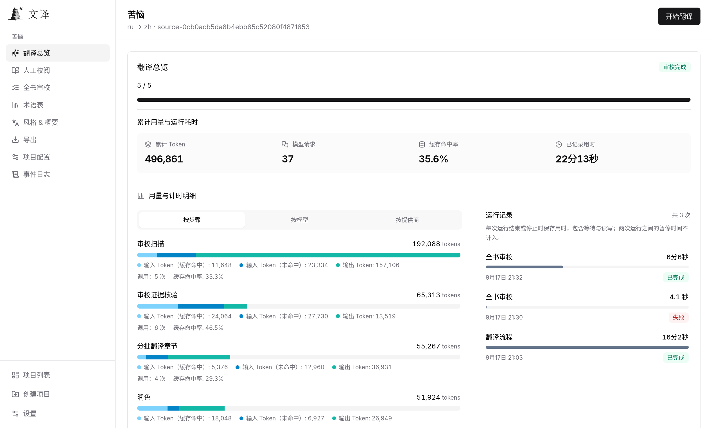

<div align="center">

<h1>
  
  <br>
  
</h1>

**Carry stories across languages.**

A desktop app for translating books and long-form writing, with the whole work in view.

Whole-book understanding · Consistent terminology · Evidence-based review

[](https://github.com/BigDawnGhost/wenyi/actions/workflows/tests.yml)
[](LICENSE)
[](https://github.com/BigDawnGhost/wenyi/stargazers)
[](https://discord.gg/sM3AQcF5D2)

[Quick start](#quick-start) · [Language support](#language-support) · [Documentation](#documentation)

**English** | [简体中文](docs/zh/README.md)

<a href="https://hellogithub.com/repository/BigDawnGhost/wenyi" target="_blank"></a>

</div>

---

## Why Wenyi

| Typical approach | Wenyi |
|---|---|
| Segments translated in isolation, unaware of surrounding content | Whole-book prescan with chapter digests and rolling context |
| Glossary managed manually or as an afterthought | Real-time term extraction with conflict detection, fed back into subsequent batches |
| Single-pass translation, fragile to interruptions | Batch checkpoints and chapter status tracking: reopen the project and resume saved progress |
| Raw model output, no systematic quality process | Translate → polish → evidence-driven whole-book review |

Wenyi is designed for **long-form texts** — novels, social-science monographs, narrative nonfiction, and more.

---

## Core features

- **Local Desktop app** — import books, translate, proofread, and save exports in one application. Projects stay in an independent local workspace; packaged releases include the Python engine, with no separate Python, PostgreSQL, Redis, or Docker setup. See the [Desktop guide](docs/desktop.md).
- **Visual proofreading** — English and Chinese interfaces, live translation progress, paragraph editing with revision history, and whole-book review with evidence and publication results. See the [interface preview](#interface-preview).
- **Native file and credential support** — drag files into a new project, choose export destinations with the system save dialog, and save API keys in the OS credential store when available.
- **Whole-book understanding** — prescans the source before translation, creating per-chapter digests and a book-level synopsis injected into every batch
- **Real-time glossary** — extracts proper names, terms, and recurring expressions as translation progresses; detects conflicting translations and surfaces them for resolution
- **Multi-stage quality** — optional polishing (strong model) and an evidence-driven whole-book AI review
- **Resumability** — completed batches and chapter progress are saved; reopen the application and continue from saved checkpoints
- **Multiple LLM providers** — DeepSeek, OpenAI, OpenRouter, OrcaRouter, Atlas Cloud, Google Gemini, Ollama, vLLM, and generic OpenAI-compatible endpoints; keep three convenient tiers or select models per operation, mix connections, and share request limits. See [model routing](docs/configuration.md#models-and-operation-routing).
- **Native EPUB preservation** — writes translated text back into the original XHTML templates and attempts to preserve styles, images, TOC, and anchors
- **Bilingual output** — optional source-and-translation edition with visually subdued source text, including dark mode support.

---

## Interface preview

Desktop and Web share these workspace pages. The screenshot below shows the translation overview in the Web Chinese interface; English is available in Settings.

<p align="center">
  
  <br>
  <sub>Translation overview: usage by step, cache hit rates, and run durations.</sub>
</p>

---

## Quick start

With Python 3.10+ and [uv](https://docs.astral.sh/uv/) installed, run from the repository root:

```bash
uv sync --locked
export DEEPSEEK_API_KEY="YOUR_DEEPSEEK_API_KEY"
uv run wenyi translate book.epub
```

This shell example uses the default DeepSeek provider. Supply your own key and review `config.yaml` before translating. For Windows commands, other providers, and resume/export options, see the [CLI guide](docs/cli.md).

Prefer a graphical app? See the [Desktop quick start](docs/desktop.md#quick-start) for downloads and setup.

---

## Supported formats

| Input | Output |
|---|---|
| EPUB, FB2, TXT, Markdown, HTML, PDF, DOCX | EPUB (monolingual / bilingual), TXT, HTML, Markdown, DOCX |
| SRT (movie / series subtitles) | SRT (monolingual / bilingual) |

- PDF input defaults to MinerU and requires its API key for the initial conversion; the resulting HTML is cached and reused. The BabelDOC bridge is optional for layout-preserving PDFs. See [PDF configuration](docs/configuration.md#pipeline).
- EPUB output attempts to preserve the original book's styles, images, table of contents, and anchors. Vertical layout is converted to horizontal for Chinese reading.
- SRT projects use a lightweight subtitle workflow without a glossary, polishing, or whole-book review.
- DOCX uses the full book pipeline. Headings, simple tables, lists, and common run/paragraph styles are preserved where possible; translated Chinese uses Song (宋体).

### Language support

Choose languages when creating a project, including directions such as Chinese → English or English → Japanese. Built-in profiles cover Chinese, English, Japanese, Korean, French, German, Spanish, Italian, Portuguese, Russian, Vietnamese, and selected variants. Multilingual translation remains experimental; real-model long-form quality needs further evaluation.

---

## Translation pipeline

Wenyi combines whole-book understanding, batch translation, optional polishing, review, and export. See the [translation pipeline](docs/pipeline.md) for the flowchart and stage details.

---

## Documentation

### Client guides

- [Desktop guide](docs/desktop.md) — installation/builds, API keys, native import and save, local data, and troubleshooting
- [CLI guide](docs/cli.md) — local installation, commands, translation, resume, and export
- [Web deployment](docs/web.md) — optional self-hosted browser workspace with its own project data

### Shared reference

- [Configuration](docs/configuration.md) — providers, languages, pipeline switches, segmentation, paths
- [Translation pipeline](docs/pipeline.md) — whole-book analysis, terminology, context, polishing, review

### Development

- [Architecture](docs/architecture.md) — module responsibilities, shared services, and platform boundaries
- [Contributing](CONTRIBUTING.md) — development, testing, and contribution guidelines

Public-domain translation examples are shared through [wenyi-bookcase](https://github.com/BigDawnGhost/wenyi-bookcase). Do not publish copyrighted text, private books, or workspace data containing sensitive information without permission.

---

## Limitations

- Multilingual translation is experimental. Prompt instructions use English, while generated descriptive metadata follows the translation target.
- Polishing and final review are the most expensive stages. Shadow fixing may
  trigger multiple full-book review passes and additional Fixer calls.
- PDF input defaults to MinerU and requires an API key for the initial conversion. The BabelDOC bridge is optional for layout-preserving PDFs.
- SRT translation does not include a glossary, polishing, or whole-book review.
- Translation quality is bounded by the capabilities of the chosen LLM model.
- Very long books may produce large workspaces; storage requirements grow with book length.

---

## Community

- [Discord server](https://discord.gg/sM3AQcF5D2)
- QQ group: 1055065098
- [GitHub Issues](https://github.com/BigDawnGhost/wenyi/issues) — bug reports and feature requests
- [GitHub Discussions](https://github.com/BigDawnGhost/wenyi/discussions) — ideas and questions

---

## Support

If this project has been helpful, tips are welcome.

<p align="center">
  
  &nbsp;&nbsp;
  
  <br>
  <sub>WeChat Pay · Alipay</sub>
</p>

---

## Star history

<a href="https://star-history.dera.page/#BigDawnGhost/wenyi&type=date&legend=top-left">
 <picture>
   <source media="(prefers-color-scheme: dark)" srcset="https://star-history.dera.page/svg?repos=BigDawnGhost/wenyi&type=date&theme=dark&legend=top-left" />
   <source media="(prefers-color-scheme: light)" srcset="https://star-history.dera.page/svg?repos=BigDawnGhost/wenyi&type=date&legend=top-left" />
   
 </picture>
</a>

---

## License

[MIT](LICENSE)

---

## AtomGit (China)

Wenyi is also hosted on AtomGit: [https://atomgit.com/BigDawnGhost/wenyi](https://atomgit.com/BigDawnGhost/wenyi)
