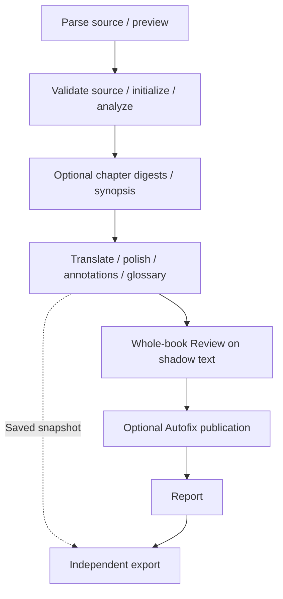

# Pipeline and persistence

[简体中文](zh/pipeline.md) · [Configuration](configuration.md)

## Entry points and architecture

`wenyi_cli` implements terminal commands. `wenyi_api` implements HTTP, WebSocket, task scheduling and PostgreSQL storage. Both call the shared `wenyi_core` services through `Orchestrator(config, client=None, storage=None)`.

The orchestration facade orders preparation, translation, annotations, Review, Autofix, reporting and assembly. It delegates model calls and state handling to domain services. Without an injected backend, the runtime constructs `FileStorage` for the CLI. Web injects `PostgresStorage`.

Book understanding, polishing, Review and Autofix are enabled by default. SRT uses an independent cue/window workflow, not the book pipeline.

## Preparation and translation

Source SHA-256 and language identity are validated before continuing a run. Web upload preview uses an Arq parser task and saves the parsed document with its source/configuration fingerprint. Preparation reuses matching preview data. Expensive PDF parsing uses the same backend/cache settings.

Initialization writes derived chapters, annotations, analysis, glossary and context before committing the initialized manifest. A failed initialization can be retried without treating partially written chapters as a completed project.

Translation batches are packed by token budget. Each completed batch saves its translations, annotation alignment, rolling context and glossary checkpoint. At chapter completion, text and status are persisted together. Existing translations without their term checkpoint are inspected for missing terminology rather than translated again. Polishing preserves `target_before_polish`; source resource and format metadata remain attached to segments/chapters.

## Review and Autofix

Whole-book Review requires translated chapters. It freezes the evidence inputs and glossary, scans blocks concurrently, verifies candidates, arbitrates contradictions, and applies temporary corrections to shadow text followed by blind rechecks. Review artifacts include metadata, results, block caches, round checkpoints, evidence and events.

When content/configuration/glossary fingerprints match, the newest completed result can be reused and an interrupted run can resume the same identity. Changed relevant input produces a new run. The result records status and termination as well as issue/change counts.

Autofix is a separate publisher, enabled by default. It persists a complete publication index before changing formal targets. Each location includes before/after hashes; repeated publication is idempotent, interrupted work resumes, and externally modified text is not overwritten. `--no-autofix` keeps formal targets unchanged while retaining shadow suggestions and diagnostics.

## Storage and concurrency

| Data | CLI | Web |
|---|---|---|
| Manifest, chapters, analysis, context | Atomic JSON under the target-specific run | PostgreSQL project/chapter/segment state |
| Terms and conflicts | SQLite | PostgreSQL, stable insertion order |
| Review, checkpoints, evidence, Autofix | JSON/JSONL artifact backend | JSON artifacts/records in PostgreSQL |
| Subtitle cues and batch cache | SRT run files | `srt/` artifact namespace in PostgreSQL |
| Usage and timing | Recoverable files / invocation ledger | Transactional ledgers / invocation identity |
| Source templates, parser resources, exports | Local resources | Shared `DATA_DIR` resources |

The `Storage` and `ArtifactStorage` ports define all mutable state operations. Domain services do not create a Web JSON/SQLite shadow store. Review run paths serve as identities under the resource directory; actual artifact reads/writes use the injected backend.

A project write lock serializes preparation, translation, Review, Autofix and manual mutations. PostgreSQL uses short transactions for state updates and does not hold a database write transaction across a model request. Export takes a consistent manifest/chapter snapshot and releases its transaction before rendering. Export jobs use `wenyi:exports`, separate from `wenyi:workflows`, so translation does not prevent a queued export from starting.

Usage is accumulated with recoverable publication and checkpoints; timing records are keyed by invocation. SRT flushes completed call usage when interrupted, retains saved cues and caches, and preserves manual cue edits on resume. Model limits are per client process, not a cross-worker distributed quota.

## Compatibility and verification

The update targets fresh Web deployments. Source changes or another target language require a new initialized Web project. Existing CLI target directories stay separate. No automatic migration of old Web state is included.

Offline tests cover all domain workflows, source identity, formatting, languages, model routing, recovery and storage boundaries. Real PostgreSQL tests cover rollback, locks, consistent snapshots, complete book/subtitle workflows, interrupted Review and Autofix, and no local state shadows. Browser tests cover the Web controls. These tests do not substitute for a real-model translation-quality comparison.
