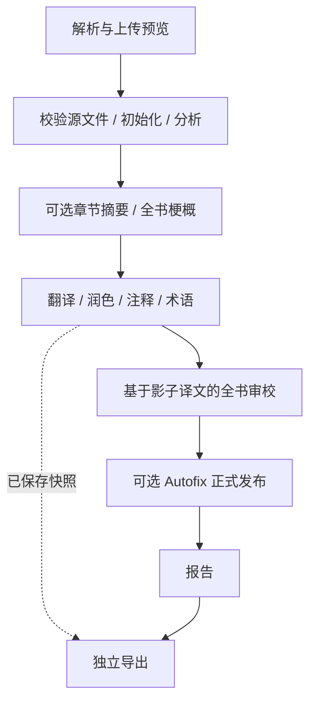

# 流水线与存储

[English](../pipeline.md) · [配置指南](configuration.md)

## 入口与架构

`wenyi_cli` 负责终端命令，`wenyi_api` 负责 HTTP、WebSocket、任务调度与 PostgreSQL 存储。两者通过 `Orchestrator(config, client=None, storage=None)` 使用 `wenyi_core` 共享领域服务。

编排器安排准备、翻译、注释、Review、Autofix、报告和导出顺序，将模型调用和状态处理交给领域服务。CLI 未注入后端时由运行时创建 `FileStorage`；Web 注入 `PostgresStorage`。

全书预理解、润色、Review 与 Autofix 默认开启。SRT 使用独立的字幕窗口流程。

## 准备与翻译

续跑前校验源文件 SHA-256 和语言身份。Web 上传预览是 Arq 解析任务，保存文档及源文件/解析配置指纹；准备阶段复用匹配预览。PDF 解析共享后端设置和昂贵转换的缓存。

初始化先写章节、注释、分析、术语和上下文，最后提交 `initialized` 标记；失败后可重试，不把半成品章节当成已初始化项目。

正文按 Token 预算组批。每批保存译文、注释定位、滚动上下文和术语检查点；章节完成时原子保存正文与状态。已有译文却缺术语检查点时补提取，不重新翻译。润色保留 `target_before_polish`，格式元数据与源资源位置保留在段落和章节中。

## Review 与 Autofix

全书审校要求所有章节已翻译。Review 固定证据输入和术语快照，并发扫描、核查候选问题、仲裁冲突，在影子译文中修订并盲审。工件包括元数据、结果、分块缓存、轮次检查点、证据和事件。

内容、配置与术语指纹一致时，可复用最新完成结果，或以原身份恢复中断审校；相关输入变化时新建运行。结果同时记录完成状态、终止原因和问题/变更数量。

Autofix 是默认开启的独立发布阶段。正式更新前先保存完整发布索引，每个位置包含原文和目标文本哈希；重复发布保持幂等，中断可恢复，外部人工修改不被旧建议覆盖。`--no-autofix` 保留正式译文，仍保存影子建议和诊断。

## 存储与并发

| 数据 | CLI | Web |
|---|---|---|
| manifest、章节、分析、上下文 | 目标语言运行目录中的原子 JSON | PostgreSQL 项目/章节/段落状态 |
| 术语与冲突 | SQLite | PostgreSQL，保持插入顺序 |
| Review、证据、检查点、Autofix | JSON/JSONL 工件 | PostgreSQL JSON 工件与事件记录 |
| 字幕与批次缓存 | SRT 运行文件 | PostgreSQL 的 `srt/` 工件空间 |
| 用量与计时 | 可恢复文件与执行账本 | 事务账本与执行身份 |
| 源模板、解析资源与成品 | 本地资源 | 共享 `DATA_DIR` 资源 |

`Storage`、`ArtifactStorage` 定义可变状态操作。领域服务不为 Web 生成本地 JSON/SQLite 状态副本。审校目录路径用于运行身份；工件读写实际交给注入的后端。

项目写锁串行化准备、翻译、Review、Autofix 和人工修改。PostgreSQL 状态更新使用短事务，模型请求期间不持有数据库写事务。导出读取一致的 manifest/章节快照后释放事务，再进行排版；导出队列 `wenyi:exports` 独立于 `wenyi:workflows`，翻译不会阻止排队导出启动。

用量借助可恢复提交和检查点累计；计时按执行身份去重。SRT 中断时保存已完成调用用量、字幕与批次缓存，恢复时保留人工字幕编辑。模型配额在客户端进程内执行，不是跨 Worker 的分布式配额。

## 兼容与验证

此次更新面向全新 Web 部署。已初始化 Web 项目更换源文件或目标语言需新建项目，CLI 的目标语言运行目录保持隔离。不提供旧 Web 状态自动迁移。

离线测试覆盖领域流程、源文件身份、格式、语言、路由、恢复和存储边界。真实 PostgreSQL 测试覆盖事务回滚、锁、一致快照、完整书籍/字幕流程、Review/Autofix 中断恢复及无本地状态副本。浏览器测试覆盖 Web 操作。这些测试不代替真实模型的译文质量对比。
